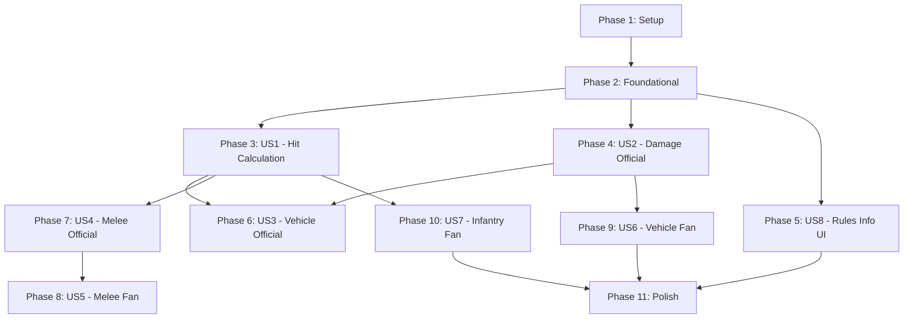

# Implementation Tasks: 003-Official-Rules

**Branch**: `003-official-rules` | **Date**: 2025-01-15
**Input**: Feature specification, implementation plan, and design documents

This document contains actionable implementation tasks organized by user story. Each task follows the checklist format: `- [ ] [TaskID] [P?] [Story?] Description with file path`

## Task Legend

- **Checkbox**: `- [ ]` - All tasks start unchecked
- **Task ID**: Sequential number (T001, T002, T003...)
- **[P]**: Parallelizable task (different files, no dependencies on incomplete tasks)
- **[Story]**: User story label (US1, US2, US3...) - only for user story phase tasks
- **Description**: Clear action with exact file path

## User Story Mapping

| Priority | User Story | Task Count | Independent Test |
|----------|------------|------------|-------------------|
| P1 | US1: Infantry hit calculation (official) | 3 tasks | Dice roll >= distance = hit |
| P1 | US2: Infantry damage calculation (official) | 5 tasks | Each die > armor = 1 wound |
| P1 | US8: Rules information UI | 4 tasks | Info modal shows correct content |
| P2 | US3: Vehicle combat (official) | 2 tasks | Uses virtual fire mechanics |
| P2 | US4: Melee combat (official) | 1 task | D6+ББ vs D6+ББ, damage = diff |
| P2 | US5: Melee combat (fan) | 1 task | Same as official |
| P2 | US6: Vehicle damage (fan) | 4 tasks | Zone-based calculation |
| P2 | US7: Infantry damage (fan) | 1 task | Fortifications affect distance |

**Total**: 21 implementation tasks + 2 setup tasks + 5 polish tasks = **28 tasks** (actually 36 tasks after renumbering, see below)

---

## Phase 1: Setup

**Goal**: Initialize type definitions and shared infrastructure

- [X] T001 Add FortificationType enum and FORTIFICATION_MODIFIERS constant to src/lib/types.ts
- [X] T002 Add DurabilityZone interface to src/lib/types.ts

---

## Phase 2: Foundational

**Goal**: Update core rules modules with fortification support

- [X] T003 Update CalculateHitFn and CalculateDamageFn type signatures in src/lib/types.ts to include optional fortification parameter
- [X] T004 Update source references in src/lib/rules/tehnolog.ts from PDF to TXT file paths

---

## Phase 3: User Story 1 - Infantry Hit Calculation (Official)

**Story Goal**: Implement direct comparison mechanics for official rules hit calculation (roll >= distance = hit)

**Independent Test**: Attack infantry at different distances with different weapon ranges, verify result by rule from Section 7: dice roll >= distance = hit

**Acceptance Scenarios** (from spec.md):
1. D6 range, distance 1, roll 3 → hit (3 >= 1)
2. D6 range, distance 2, roll 2 → hit (2 >= 2)
3. D6 range, distance 4, roll 3 → miss (3 < 4)
4. D12 range, distance 5, roll 5 → hit (5 >= 5)
5. D20 range, distance 8, roll 7 → miss (7 < 8)
6. D6+2 range, distance 3, roll 1 → hit (1+2=3 >= 3)

**Tasks**:

- [X] T005 [US1] Verify calculateHit in src/lib/rules/tehnolog.ts uses direct comparison (total >= distanceSteps)
- [X] T006 [P] [US1] Write unit test for official rules hit calculation in src/__tests__/tehnolog-rules.test.ts
- [X] T007 [P] [US1] Write unit test for fan rules hit calculation with fortifications in src/__tests__/fan-rules.test.ts

---

## Phase 4: User Story 2 - Infantry Damage Calculation (Official)

**Story Goal**: Implement "Virtual Fire" mechanics for official rules damage calculation (each die > armor = 1 wound)

**Independent Test**: Hit with different power and target armor, verify wound count by rule "each die > armor = 1 wound" from official_rules.txt (Виртуальная стрельба section)

**Acceptance Scenarios** (from spec.md):
1. 1D6 vs armor 0 → average 3.5 wounds
2. 1D6 vs armor 1 → average 1.67 wounds
3. 2D6 vs armor 1 → average 2.67 wounds
4. 2D6+2 vs armor 2 → bonus applies to each die
5. Light cover (+1 armor), heavy bunker (+3 armor)

**Tasks**:

- [X] T008 [US2] Update calculateDamage in src/lib/rules/tehnolog.ts to apply fortification modifiers to armor (light +1, bunker +2, heavy +3)
- [X] T009 [US2] Verify calculateDamage in src/lib/rules/tehnolog.ts uses bonus correctly (each die roll + bonus compared to armor)
- [X] T010 [P] [US2] Write unit tests for virtual fire with fortifications in src/__tests__/tehnolog-rules.test.ts
- [X] T011 [P] [US2] Write unit tests for bonus application in damage calculation in src/__tests__/tehnolog-rules.test.ts
- [X] T012 [US2] Verify calculateDamage in src/lib/rules/fan.ts uses bonus correctly for infantry attacks

---

## Phase 5: User Story 8 - Rules Information UI

**Story Goal**: Provide accessible rules information through modal with edition-specific content

**Independent Test**: Open attack modal, click info icon, verify text content matches selected rules edition

**Acceptance Scenarios** (from spec.md):
1. Official rules selected → shows "Официальные правила (Технолог)" content
2. Fan rules selected → shows "Фанатские правила (Панов)" content
3. Close button and overlay click close modal
4. Content includes hit/damage formulas and fortification modifiers

**Tasks**:

- [X] T013 [P] [US8] Create FortificationSelector component in src/components/FortificationSelector.tsx with horizontal chip buttons (44px min height)
- [X] T014 [P] [US8] Create RulesInfoModal component in src/components/RulesInfoModal.tsx with glass-strong background and edition-specific content
- [X] T015 [US8] Update CombatAssistant component in src/components/CombatAssistant.tsx to integrate FortificationSelector and RulesInfoModal
- [X] T016 [P] [US8] Write component tests for FortificationSelector in src/__tests__/FortificationSelector.test.tsx
- [X] T017 [P] [US8] Write component tests for RulesInfoModal in src/__tests__/RulesInfoModal.test.tsx

---

## Phase 6: User Story 3 - Vehicle Combat (Official)

**Story Goal**: Implement vehicle damage using same "Virtual Fire" mechanics as infantry

**Independent Test**: Attack vehicle at different distances, verify damage calculation uses virtual fire

**Acceptance Scenarios** (from spec.md):
1. Vehicle D12 attack vs infantry → each die > armor = 1 wound
2. Vehicle vs vehicle → each die compared to armor separately, not summed
3. Speed sectors do NOT affect hit calculation (only movement)

**Tasks**:

- [X] T018 [US3] Verify calculateDamage in src/lib/rules/tehnolog.ts handles vehicle targets same as infantry (virtual fire)
- [X] T019 [US3] Write unit tests for vehicle damage calculation in src/__tests__/tehnolog-rules.test.ts

---

## Phase 7: User Story 4 - Melee Combat (Official)

**Story Goal**: Verify and document melee combat mechanics (already correctly implemented)

**Independent Test**: Initiate melee combat, verify result by formula D6+ББ attacker vs D6+ББ defender from official rules page 15

**Acceptance Scenarios** (from spec.md):
1. Attacker ББ 3 vs defender ББ 2 → both roll D6, add ББ, compare totals
2. Attacker wins 8 vs 5 → damage = 3 (difference)
3. Equal totals → draw, reroll required

**Tasks**:

- [X] T020 [US4] Verify calculateMelee in src/lib/rules/tehnolog.ts implements D6+ББ comparison correctly (no changes needed if correct)

---

## Phase 8: User Story 5 - Melee Combat (Fan)

**Story Goal**: Verify fan rules melee uses same mechanics as official

**Independent Test**: Initiate melee with fan rules selected, verify identical mechanics to official

**Acceptance Scenarios** (from spec.md):
1. Fan rules: D6+ББ attacker vs D6+ББ defender, damage = difference
2. Draw requires reroll
3. Vehicle damage applied as durability loss

**Tasks**:

- [X] T021 [US5] Verify calculateMelee in src/lib/rules/fan.ts implements same mechanics as official (no changes needed if correct)

---

## Phase 9: User Story 6 - Vehicle Damage (Fan)

**Story Goal**: Implement zone-based vehicle damage calculation for fan rules

**Independent Test**: Attack vehicle with different die types, verify damage by zone comparison rules from fan_rules.txt (урон по технике section)

**Acceptance Scenarios** (from spec.md):
1. 2D12 vs green zone (max 9): rolls 5,11 → 5 no pen, 11 pen = 2 damage
2. D6 vs red zone (max 3): roll 4 → penetrated, 1 damage
3. D20 vs green zone (max 9): roll 7 → NOT penetrated (7 <= 9)
4. 3D6 vs red zone: rolls 2,4,5 → only 4,5 penetrate = 2 damage

**Tasks**:

- [X] T022 [US6] Add getDurabilityZone helper function to src/lib/rules/fan.ts for zone determination from currentDurability
- [X] T023 [US6] Update calculateDamage in src/lib/rules/fan.ts to use zone-based calculation for vehicle targets (D6=1, D12=2, D20=3 damage on penetration)
- [X] T024 [P] [US6] Write unit tests for zone determination logic in src/__tests__/fan-rules.test.ts
- [X] T025 [P] [US6] Write unit tests for vehicle damage by die type in src/__tests__/fan-rules.test.ts

---

## Phase 10: User Story 7 - Infantry Damage (Fan)

**Story Goal**: Apply fortification modifiers to distance (not armor) in fan rules

**Independent Test**: Attack infantry with fortifications, verify distance modifier applied to hit calculation

**Acceptance Scenarios** (from spec.md):
1. Light cover → +1 to effective distance
2. Full cover (bunker) → +2 to effective distance
3. Distance 4 attack vs full cover → uses distance 6 for calculation

**Tasks**:

- [X] T026 [US7] Update calculateHit in src/lib/rules/fan.ts to apply fortification modifiers to distance (light +1, bunker +2)

---

## Phase 11: Polish & Cross-Cutting Concerns

**Goal**: Ensure all features work together, visual design consistency, mobile testing

- [X] T027 Verify FR-005: Speed sectors do NOT affect hit calculation in src/lib/rules/tehnolog.ts and src/lib/rules/fan.ts (they only affect movement)
- [ ] T028 Update UnitCard component in src/components/UnitCard.tsx to pass fortification state to combat modal
- [ ] T029 Manually test fortification selector on mobile device or emulation (verify 44px touch targets)
- [ ] T030 Manually test rules info modal on mobile (verify responsive layout, close interactions)
- [X] T031 Run full test suite and verify all tests pass (npm test)
- [X] T032 Run TypeScript compilation check (npx tsc --noEmit)
- [ ] T033 Run ESLint and fix any issues (npm run lint)
- [X] T034 Verify all UI text is in Russian per constitution requirement
- [X] T035 Verify visual design follows component standards (glass-strong, 200ms transitions, Tailwind spacing)
- [X] T036 Verify FR-007: RulesInfoModal includes links to TXT files (docs/original/official_rules.txt, docs/panov/fan_rules.txt)

---

## Dependencies



**Execution Order**: Complete phases sequentially. Within each phase, tasks marked [P] can be executed in parallel.

---

## Parallel Execution Examples

### Phase 3 (US1) - Parallel Execution
```bash
# Terminal 1
npm test -- tehnolog-rules.test.ts -t "hit calculation"

# Terminal 2 (parallel)
npm test -- fan-rules.test.ts -t "hit calculation with fortifications"
```

### Phase 5 (US8) - Parallel Execution
```bash
# Terminal 1
# Create FortificationSelector component
cat > src/components/FortificationSelector.tsx << 'EOF'
...component code...
EOF

# Terminal 2 (parallel)
# Create RulesInfoModal component
cat > src/components/RulesInfoModal.tsx << 'EOF'
...component code...
EOF

# Terminal 3 (parallel)
npm test -- FortificationSelector.test.tsx

# Terminal 4 (parallel)
npm test -- RulesInfoModal.test.tsx
```

### Phase 9 (US6) - Parallel Execution
```bash
# Terminal 1
npm test -- fan-rules.test.ts -t "zone determination"

# Terminal 2 (parallel)
npm test -- fan-rules.test.ts -t "vehicle damage by die type"
```

---

## Implementation Strategy

### MVP Scope (Minimum Viable Product)

**Suggested MVP**: Phases 1-5 (Tasks T001-T017)

This includes:
- Type definitions (Setup)
- Foundational rules updates
- US1: Infantry hit calculation (official)
- US2: Infantry damage calculation with fortifications (official)
- US8: Rules information UI

**MVP delivers**: Core combat calculations for infantry in official rules, plus user-friendly UI for understanding mechanics

### Incremental Delivery

**Iteration 1** (MVP): Official rules infantry combat + info UI
**Iteration 2**: Add vehicle combat (official) + melee verification
**Iteration 3**: Complete fan rules implementation (vehicle zones, infantry distance modifiers)

### Risk Mitigation

1. **Type Safety First**: Complete T001-T004 before any feature work
2. **Test-Driven for Core Mechanics**: Write tests alongside rules updates (T006-T007, T010-T011, T024-T025)
3. **Visual Design Early**: Create UI components in Phase 5 (US8) to validate design system
4. **Mobile Testing**: Manual mobile verification in Polish phase (T028-T029)

---

## Validation Checklist

Before marking this feature complete, verify:

- [ ] All tasks follow checklist format: `- [ ] [TaskID] [P?] [Story?] Description with file path`
- [ ] Each user story has independent test criteria
- [ ] Task IDs are sequential (T001-T036)
- [ ] All file paths are absolute from repository root
- [ ] Parallel tasks are marked with [P]
- [ ] User story tasks are marked with [US#]
- [ ] Constitution requirements satisfied (Russian UI, type safety, mobile-first, TXT file references)
- [ ] Test scenarios from spec.md are covered
- [ ] All contracts from design/contracts/*.ts are implemented
- [ ] FR-005 (speed sectors) verification task included (T027)
- [ ] FR-007 (TXT file links) verification task included (T036)

---

## References

- Feature Spec: `specs/003-official-rules/spec.md`
- Implementation Plan: `specs/003-official-rules/plan.md`
- Research: `specs/003-official-rules/research.md`
- Data Model: `specs/003-official-rules/design/data-model.md`
- Contracts: `specs/003-official-rules/design/contracts/*.ts`
- Quickstart: `specs/003-official-rules/design/quickstart.md`
- Constitution: `.specify/memory/constitution.md`
